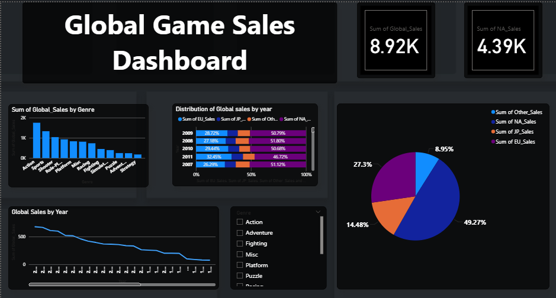

# 🎮 **Video Game Sales Analysis**

Analyzing global video game sales to uncover insights on platforms, genres, publishers, and regional performance using **Excel, SQL, Python, and Power BI**.

---

## 📌 **Overview**

This project focuses on **descriptive analytics** to understand sales trends and business performance in the video game industry.  
It demonstrates **end-to-end data analysis** — from cleaning and querying to visualization and storytelling — using multiple analytical tools.

---

## ❓ **Problem Statement**

To identify **key factors that influence global video game sales** and determine which **platforms, genres, and publishers** dominate the market.

---

## 🗂️ **Dataset**

| Attribute | Description |
|------------|-------------|
| **Source** | Kaggle (Video Game Sales Dataset) |
| **Total Records** | 16,598 |
| **Fields** | Rank, Name, Platform, Year, Genre, Publisher, Regional Sales, Global Sales |

---

## 🛠️ **Tools & Technologies**

| Tool | Purpose |
|------|----------|
| **Excel** | Data cleaning, pivot tables, initial charts |
| **MySQL** | SQL querying and data aggregation |
| **Python** | Exploratory data analysis (EDA) |
| **Power BI** | Interactive dashboard and data storytelling |

---

## ⚙️ **Methods**

### 🧹 Data Cleaning *(Excel)*
- Removed incomplete and duplicate records  
- Standardized data types and formatted columns  

### 💾 SQL Analysis *(MySQL)*
> - Aggregated total and average global sales  
> - Ranked platforms, genres, and publishers  
> - Analyzed year-wise and region-wise performance  

### 📊 EDA *(Python)*
- Explored distributions and relationships using Pandas  

### 📈 Power BI Dashboard
Created an interactive dashboard featuring:
- Global sales trends (year-wise)  
- Top-performing platforms and genres  
- Regional breakdowns  
- Publisher analysis  

---

## 💡 **Key Insights**

| Metric | Value |
|--------|--------|
| **Total Global Sales** | 7,623.23 million units |
| **Average Sales per Game** | ~1.37 million units |
| **Top Platforms** | PS2, Xbox 360, PS3, Wii |
| **Top Genres** | Action, Sports, Shooter |
| **Sales Trends** | Peak during 2000–2010; decline post-2010 (digital shift) |

> 📊 **Insight:** The 2000s were the golden era of physical game sales. Sony and Microsoft consoles led the global gaming markets.

---

## 🖥️ **Dashboard**

An interactive **Power BI dashboard** summarizes all key insights.  
It allows filtering by **year, genre, platform, and publisher**, providing a clear visual understanding of global sales performance.

---

## ▶️ **How to Run this Project**

1. Clone the repository from GitHub  
2. Open the dataset in Excel or import it into MySQL  
3. Run the provided SQL queries for aggregation and insights  
4. Open the Power BI file to explore interactive visualizations  
5. (Optional) Use Python scripts for additional EDA  

---

## 🏁 **Results & Conclusion**

This project demonstrates the ability to:
- Clean, process, and analyze real-world datasets  
- Derive meaningful business insights  
- Build professional dashboards using Power BI  

It highlights strong skills in **data analysis, visualization, and storytelling**.

---

## 🔮 **Future Work**

> - Add predictive modeling to forecast future sales trends  
> - Integrate APIs to include modern digital sales data  
> - Enhance dashboard with dynamic data updates  

---

## 👨‍💻 **Author & Contact**

**Developed by:** Salman Shaikh  
**GitHub:** [codebysalmanshaikh](https://github.com/codebysalmanshaikh)  
**Email:** salmans3724@gmail.com  

---
